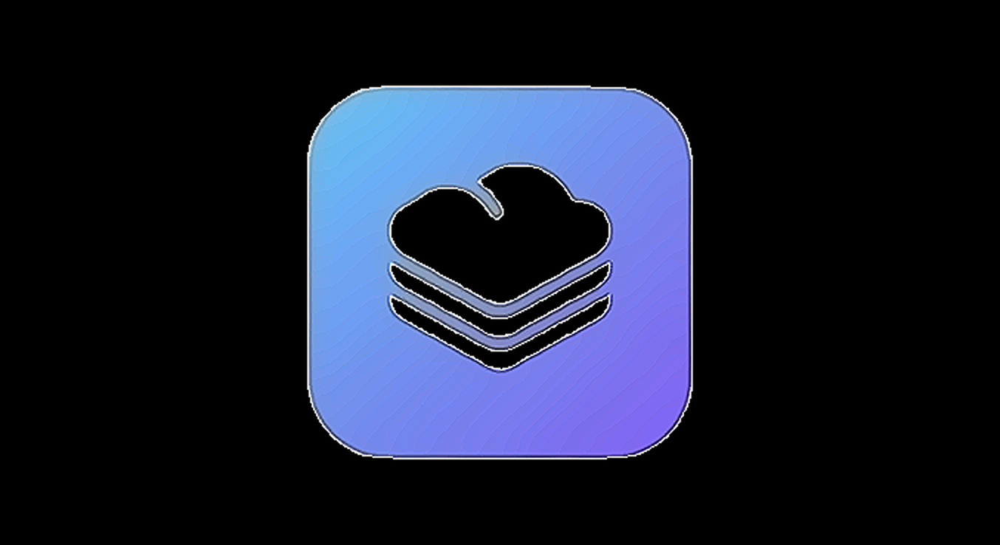

# FileBox

Premium Laravel 12 SaaS starter for secure file storage with Stripe billing and a polished UX. Built by **Youssef Youyou** — all rights reserved.

## At a Glance
- 🔐 Auth + email verification (Breeze)
- 📦 Per-user storage quotas with live usage bars
- 📁 Folders, uploads, downloads, previews
- 💳 Stripe Cashier checkout + customer portal-ready
- 🌓 Dark/light theming, responsive dashboard + landing

## Tech Stack
- Laravel 12, PHP 8.2+
- Breeze (Blade) + Vite + Tailwind
- Laravel Cashier (Stripe)
- MySQL (or compatible), Redis optional

## Quickstart

| Step | Command |
| --- | --- |
| 1) Copy env | `cp .env.example .env` |
| 2) Install PHP deps | `composer install` |
| 3) Install JS deps | `npm install` |
| 4) App key | `php artisan key:generate` |
| 5) Migrate + seed | `php artisan migrate --seed` |
| 6) Build assets | `npm run build` (or `npm run dev`) |
| 7) Serve | `php artisan serve` |

### Required .env keys
| Key | Example |
| --- | --- |
| `APP_NAME` | FileBox |
| `APP_URL` | http://localhost:8000 |
| `DB_DATABASE` | filebox |
| `DB_USERNAME` | your_user |
| `DB_PASSWORD` | your_pass |
| `STRIPE_SECRET` | sk_test_xxx |
| `STRIPE_PRICE_PRO` | price_xxx |

## How to Use
- Sign up or log in, then open **Files** to upload or create folders.
- Watch storage usage on the dashboard; quotas enforced per user.
- Upgrade/manage billing from dashboard or profile (requires Stripe keys and price ID).

## Testing
```bash
php artisan test
```

## License
All rights reserved © Youssef Youyou.
